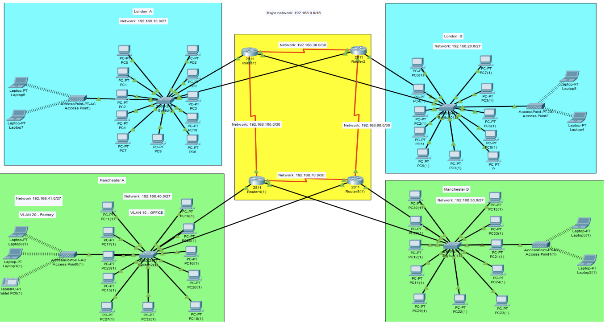
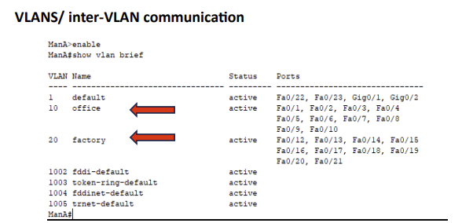
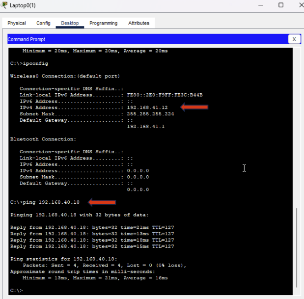
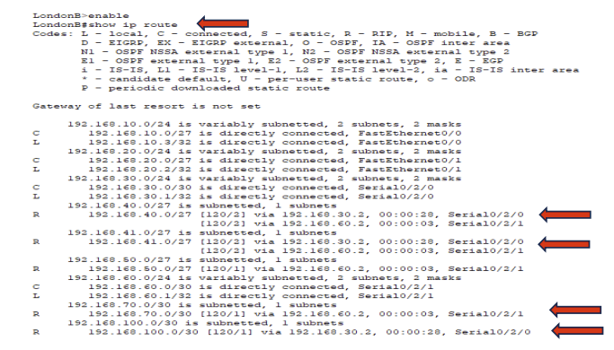
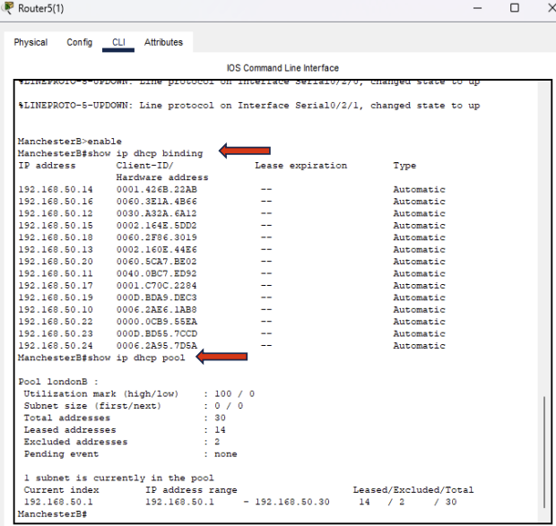
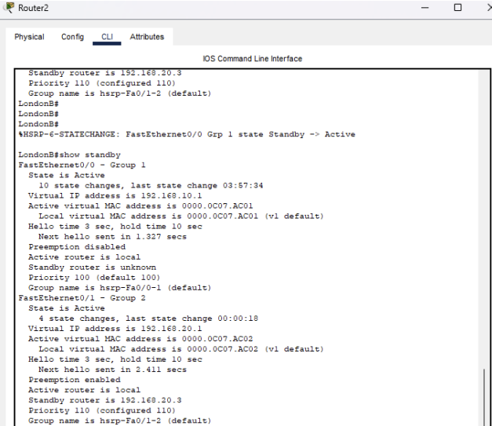
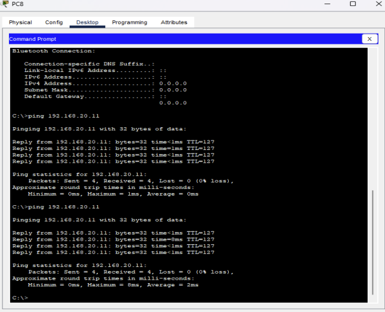
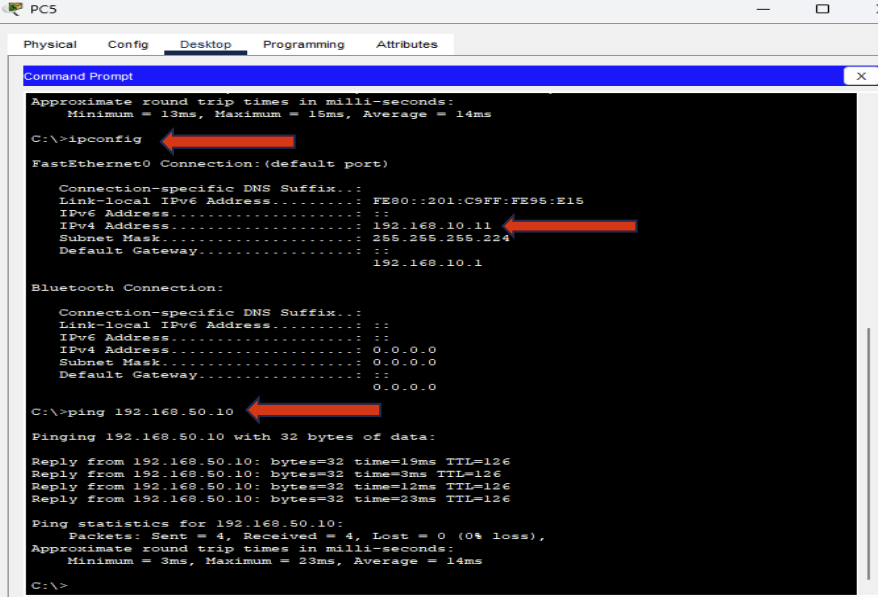
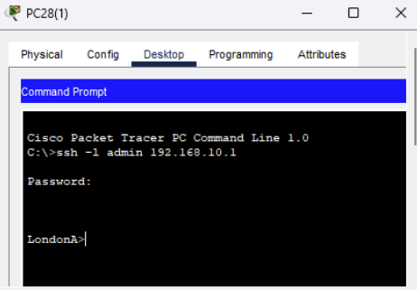

# Cisco Enterprise Network Design

## Project Overview

This project demonstrates the design, configuration and testing of a multi-site enterprise network for a fictional organisation, **Glance Ltd**, using Cisco Packet Tracer.

The network was designed to support approximately 50 employees across four offices in London and Manchester while providing wired and wireless connectivity, network segmentation, dynamic routing, automated IP addressing, secure remote administration and gateway redundancy.

The project focuses on building a scalable and resilient network using technologies commonly found in enterprise networking environments.

---

## Network Topology

The network consists of four office networks:

- London A
- London B
- Manchester A
- Manchester B

Each site contains switched LAN infrastructure and wireless connectivity through access points.

The offices are interconnected through routers and point-to-point WAN links, allowing communication between the different locations.

---

## Technologies Implemented

- Cisco Packet Tracer
- IPv4 addressing
- VLSM subnetting
- VLANs
- Inter-VLAN routing
- RIPv2 dynamic routing
- DHCP
- HSRP gateway redundancy
- SSH remote administration
- Point-to-point WAN links
- Wired and wireless networking
- Network connectivity testing

---

## IP Addressing and VLSM

The private address space `192.168.0.0/16` was used as the major network.

VLSM was used to divide the address space into `/27` LAN networks for office environments and `/30` networks for point-to-point WAN connections.

This provides sufficient addressing for the required hosts while allowing the addressing scheme to remain organised and scalable.

| Location | Network | Gateway | Broadcast |
|---|---|---|---|
| London A | `192.168.10.0/27` | `192.168.10.1` | `192.168.10.31` |
| London B | `192.168.20.0/27` | `192.168.20.1` | `192.168.20.31` |
| Manchester A - Office | `192.168.40.0/27` | `192.168.40.1` | `192.168.40.31` |
| Manchester A - Factory | `192.168.41.0/27` | `192.168.41.1` | `192.168.41.31` |
| Manchester B | `192.168.50.0/27` | `192.168.50.1` | `192.168.50.31` |

Point-to-point WAN connections use `/30` networks to minimise unused addresses.

---

## VLAN Segmentation

The Manchester A network was segmented into two VLANs:

| VLAN | Name | Network |
|---|---|---|
| 10 | Office | `192.168.40.0/27` |
| 20 | Factory | `192.168.41.0/27` |

VLANs provide logical separation between the Office and Factory networks and reduce unnecessary broadcast traffic.

### Inter-VLAN Routing

Inter-VLAN routing was configured to allow devices in the two VLANs to communicate where required.

Connectivity testing confirmed successful communication between VLAN 20 and VLAN 10.

This demonstrates that VLAN segmentation and inter-VLAN communication were operating successfully.

---

## Dynamic Routing with RIPv2

RIPv2 was configured between the routers to dynamically advertise and learn remote networks.

This allows routers to update their routing information automatically rather than requiring every remote network to be configured using static routes.

The routing table shows routes marked with `R`, demonstrating networks learned through RIP.

RIPv2 was suitable for the scope of this project due to its simplicity and support for the VLSM addressing scheme used throughout the network.

For a larger enterprise environment, a more scalable dynamic routing protocol such as OSPF could be considered.

---

## DHCP

DHCP pools were configured to automatically provide end devices with network configuration including:

- IPv4 address
- Subnet mask
- Default gateway

This reduces manual configuration and makes it easier to deploy devices across the network.

The DHCP bindings demonstrate multiple addresses being dynamically assigned to clients.

---

## Gateway Redundancy with HSRP

HSRP was implemented to provide default gateway redundancy.

The routers operate using active and standby roles while hosts use a virtual IP address as their default gateway.

If the active router becomes unavailable, the standby router can take over the gateway role.

### Failover Testing

HSRP was tested by deliberately shutting down an interface on the active London router.

The standby router successfully transitioned to the **Active** state.

Connectivity was then tested during the simulated failure.

The successful ping responses demonstrate that connectivity was maintained during the router failover.

This provided practical verification that the redundancy mechanism was functioning as intended.

---

## Cross-Site Connectivity

End-to-end testing was performed between devices located on different office networks.

A host within the London network was able to successfully communicate with a host within the Manchester network.

The successful test demonstrates that the IP addressing, WAN connections and routing configuration were working together correctly.

---

## Secure Remote Administration with SSH

SSH was configured to provide encrypted remote access to network devices.

A device located within the Manchester network successfully established an SSH session with a router located in London.

This demonstrates remote administration of network infrastructure across the routed enterprise network.

---

## Network Testing

Testing was performed throughout the project to verify that the network operated as intended.

Testing included:

- Cross-site ICMP connectivity
- Inter-VLAN connectivity
- RIPv2 route learning
- DHCP address allocation
- HSRP active/standby operation
- HSRP failover
- Connectivity during gateway failure
- SSH remote access

The testing confirmed successful communication between the different office networks and demonstrated that the major network services were functioning correctly.

---

## Design Considerations

The network was designed with scalability and redundancy in mind.

### Scalability

The use of a large private address space and VLSM allows additional networks, sites and devices to be incorporated without redesigning the entire addressing scheme.

### Redundancy

Multiple routers and WAN connections provide alternative paths through the network.

HSRP provides additional gateway resilience by allowing a standby router to take over if the active gateway becomes unavailable.

### Segmentation

VLANs were used to logically separate the Manchester A Office and Factory networks.

Further access restrictions between network segments could be implemented using technologies such as ACLs or firewalls.

### Routing

RIPv2 provides automatic route learning for the current network size.

For significant future expansion, a more scalable routing protocol such as OSPF could be considered.

---

## Skills Demonstrated

This project demonstrates practical experience with:

- Enterprise network design
- Cisco router and switch configuration
- TCP/IP networking
- IPv4 subnetting and VLSM
- VLAN configuration
- Inter-VLAN routing
- Dynamic routing with RIPv2
- DHCP configuration
- HSRP gateway redundancy
- Network failover testing
- SSH remote device administration
- Wired and wireless networking
- Network troubleshooting
- Connectivity verification
- Cisco Packet Tracer

---

## Packet Tracer Project

The complete Cisco Packet Tracer topology is available here:

[`Glance ltd.pkt`](packet-tracer/Glance%20ltd.pkt)

The file can be opened using Cisco Packet Tracer to inspect the network topology and device configurations.
